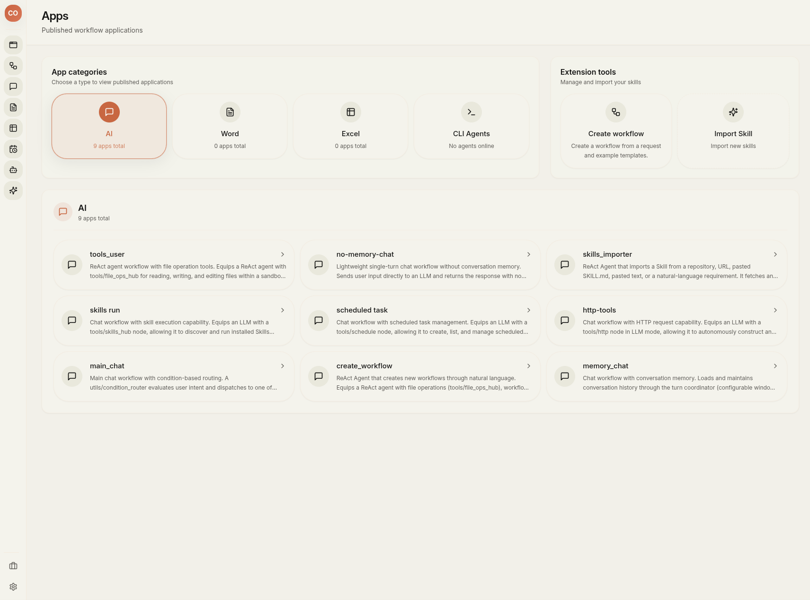
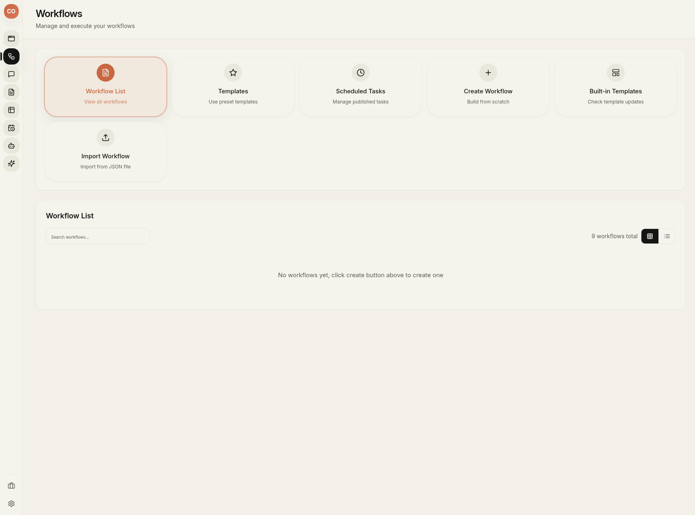
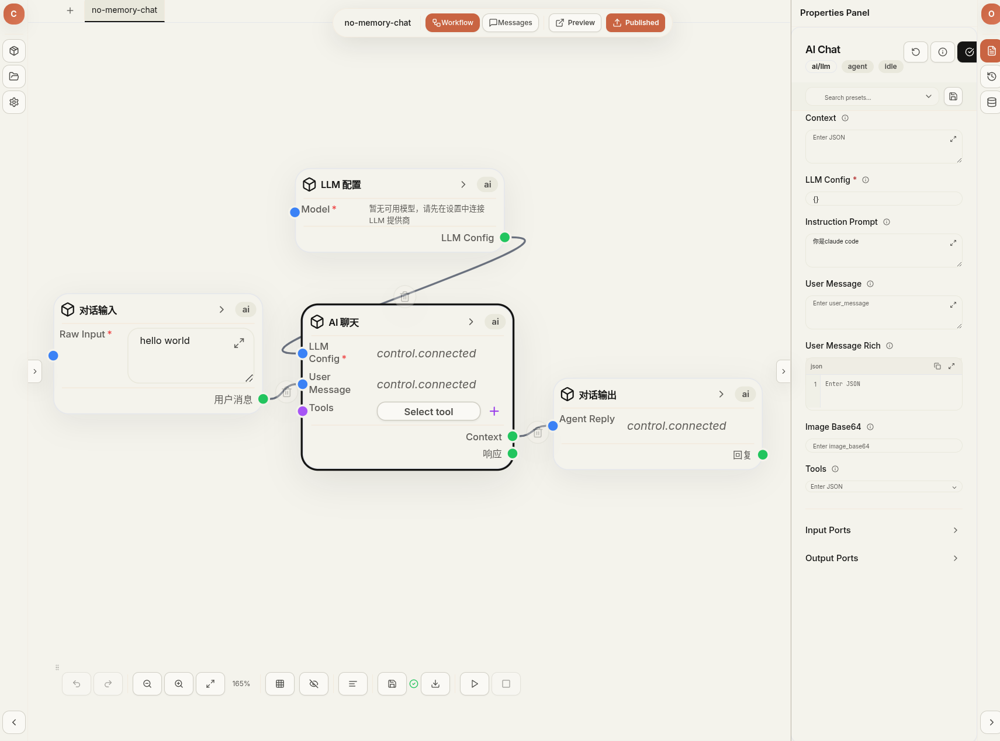
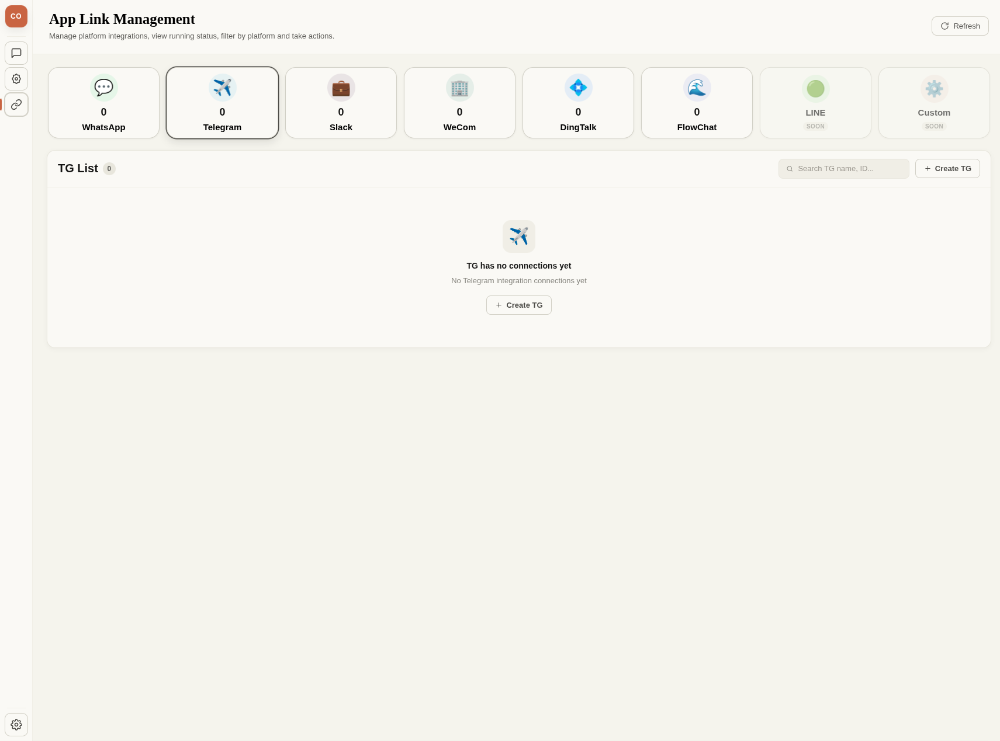
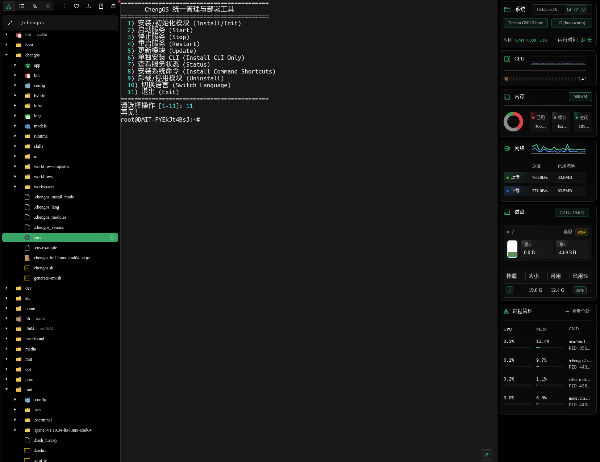
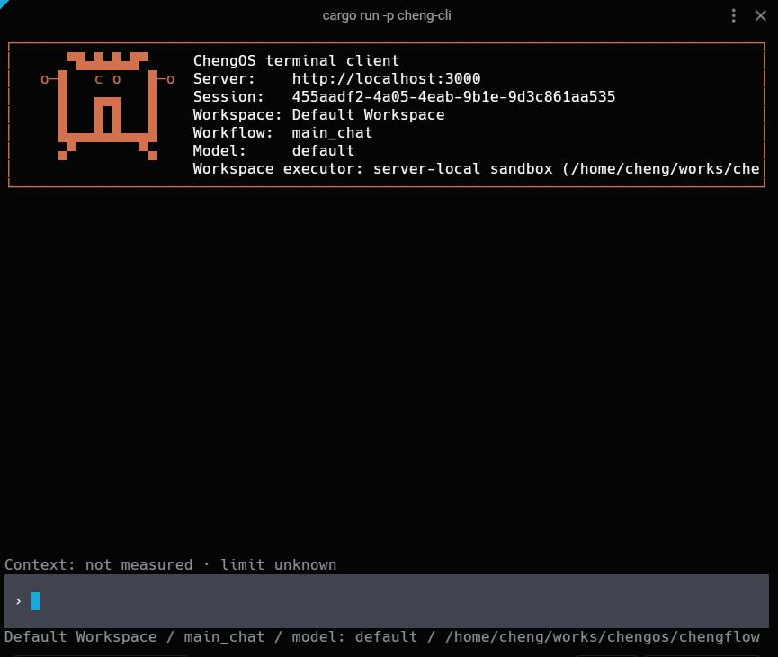
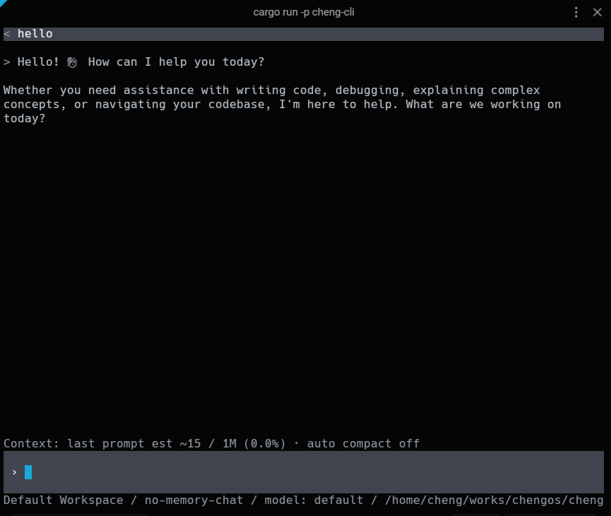

<div align="center">


<h1 id="chengos">ChengOS</h1>

<hr>

<strong>Visual AI workflows and agent runtime</strong>

Build, publish, and deploy intelligent workflows across web, mobile, messaging, and terminal clients.

<br>
<br>


<br>
<br>

[Website](https://chengos.dev/) · [Live Demo](#live-demo) · [Overview](#overview) · [Screenshots](#screenshots) · [Quick start](#quick-start) · [中文介绍](#中文介绍)

</div>

---

<a id="overview"></a>

## Overview

ChengOS is a visual platform for building, running, and publishing AI workflows and agents. It combines a Rust workflow engine, a browser-based workflow editor, multi-channel chat applications, a terminal client, and a unified deployment toolkit.

This repository provides the deployment scripts, infrastructure configuration, built application assets, and runtime resources needed to operate ChengOS in development or production.

<a id="live-demo"></a>

### Live demo

| Service | URL |
|---|---|
| Visual workflow editor and administration | [demo-ui.chengrouter.com](https://demo-ui.chengrouter.com/) |
| Published applications and chat | [demo-app.chengrouter.com](https://demo-app.chengrouter.com/) |

Use the following shared demo account for both services:

- **Email:** `demo@chengrouter.com`
- **Password:** `demo123456`

### What you can build

- Visual AI and automation workflows with reusable nodes and subflows.
- ReAct agents that can discover and invoke tools, MCP servers, and Skills.
- Web, mobile, embedded, and messaging-channel chat applications.
- Local document, spreadsheet, RAG, and multimodal processing pipelines.
- Terminal-based agents that connect to a local or remote ChengOS server.

<a id="screenshots"></a>

## Screenshots

| Applications and Skills | Workflow management |
|---|---|
|  |  |

| Visual workflow editor | Messaging-channel integrations |
|---|---|
|  |  |

### Deployment console



### Terminal client

| Connect to a workspace | Chat with an agent |
|---|---|
|  |  |

## Architecture

ChengOS uses a client-server architecture. The Rust backend exposes REST and WebSocket interfaces to the visual editor, application gateway, and terminal client.

```text
                         ┌───────────────────────────────────┐
                         │    Backend service (chengflow)    │
                         │    Rust DAG engine / REST & WS    │
                         └─────────────────┬─────────────────┘
                                           │
             ┌─────────────────────────────┼─────────────────────────────┐
             ▼                             ▼                             ▼
┌────────────────────────┐   ┌────────────────────────┐   ┌────────────────────────┐
│ Visual editor & admin  │   │ App and chat gateway   │   │ Terminal client        │
│ chengflow-ui           │   │ chengflow-app          │   │ cheng CLI              │
│ React Flow canvas      │   │ Web / H5 / PWA         │   │ Local or remote server │
└────────────────────────┘   └────────────────────────┘   └────────────────────────┘
```

| Component | Technology | Responsibility |
|---|---|---|
| `chengflow` / `cheng-api` | Rust | DAG execution, REST and WebSocket APIs, sandboxing, credentials, multi-tenancy, vector retrieval, and scheduling. |
| `chengflow-ui` / `cheng-ui` | React + TypeScript + Vite | Visual workflow editing, administration, MCP configuration, Skills, and local document workspaces. |
| `chengflow-app` / `cheng-app` | React + TypeScript + Vite | Published applications, embedded chat, responsive H5/PWA interfaces, and channel routing. |
| `cheng` CLI (`chengctl`) | Rust | Local or cross-device terminal chat, workflow execution, and agent interaction. |
| `deploy/` | Shell + Docker Compose | Installation, configuration, lifecycle management, updates, and deployment resources. |

## Key features

### Visual workflows and agents

Build workflows on a React Flow canvas, configure nodes through a properties panel, test them interactively, and publish them as applications. ReAct agents support multi-step tool use, while subflows and batch subflows enable composition and parallel processing.

### Native MCP support

- Connect to MCP servers over Stdio, SSE, or HTTP through `tools/mcp_hub`.
- Discover tools, prompts, and resources dynamically from workflows and agents.
- Manage connections in the web UI or inject preset configuration through environment settings.

### Multi-format Skill import

The built-in Skill importer can create runnable Skill packages from natural-language requirements, web pages or API documentation, Git repositories, standard `SKILL.md` files, and ZIP packages. Imported Skills pass through parsing, validation, review, safe writing, and hot reload.

### Credential isolation

Secrets are stored in the backend credential vault rather than embedded in workflows, Skills, or scripts. Tools and Skills receive credentials only at execution time, keeping raw values out of LLM prompt context. Sandboxing and `user_id` isolation provide additional boundaries.

### Local documents, spreadsheets, and RAG

ChengOS includes local Word (`.docx`) and spreadsheet (`.xlsx` or grid) workspaces. Agents can read, format, update, and generate content through document and table nodes without requiring a third-party online office suite. RAG nodes cover chunking, indexing, retrieval, and vector search.

### Multiple chat entry points

- Embedded chat in the workflow editor for testing and iteration.
- Web, H5, PWA, and messaging channels such as WhatsApp, Telegram, Slack, WeCom, DingTalk, and FlowChat.
- A lightweight terminal client for local development and remote servers.

<a id="quick-start"></a>

## Quick start

Launch the interactive bilingual management console:

```bash
./chengos.sh
```

The console can install, start, stop, restart, update, inspect, or uninstall modules. It can also install the CLI independently, create system command shortcuts, and switch between English and Chinese.

### Native deployment

Run the API and static web applications directly on the host:

```bash
./chengos.sh install --mode native --db-install-mode managed-process --with api,ui,app,cli
./chengos.sh start
./chengos.sh status
```

Database installation modes:

- `managed-process` (default): runs PostgreSQL, Valkey, and Qdrant as unprivileged processes without root access.
- `system-service`: installs databases as systemd services through the system package manager and requires `sudo`.

### Docker Compose deployment

```bash
./chengos.sh install --mode docker --with api,ui,app,cli
./chengos.sh start
./chengos.sh stop
```

Pin an exact release instead of `latest` — all four ChengOS images resolve their
tag from one `CHENGOS_VERSION` value in `.env`:

```bash
# deploy/.env
CHENGOS_VERSION=0.1.0
```

`latest` is a first-install convenience only. It is **not** a reproducible
production version and is never an update or rollback target.

### Versions, updates, and rollback

```bash
./chengos.sh status     # installed version, running version, latest stable, health
./chengos.sh update     # upgrade-only; checksum + signature verified, auto-restore on failure
./chengos.sh rollback   # restore the previous release
```

Full release, artifact-verification, update, and rollback procedures — including
when a database migration makes automatic rollback unsafe — are documented in the
[Release Operations Guide](chengflow/docs/release-operations-guide.md).

### Standalone CLI and remote access

Install only the `cheng` terminal client:

```bash
./chengos.sh cli
```

Choose a local connection to `http://127.0.0.1:3000`, or enter the URL of a remote ChengOS server. Once configured, start the client from any terminal:

```bash
cheng
```

## Workflow toolset

| Category | Representative tools |
|---|---|
| Code and shell | `tools/code_shell`, `tools/code_python`, `tools/code_js` |
| Files and workspace | `tools/read_file`, `tools/write_file`, `tools/edit_file`, `tools/patch_file`, `tools/search_files`, backup and rollback tools |
| Web and remote access | `tools/http`, `tools/browser`, `tools/web`, `tools/mail`, `tools/ssh`, `tools/fetch_repository` |
| AI and multimodal | `ai/llm`, `ai/llm_branch`, `agent/react_agent`, image/audio/video generation, ASR, OCR, and translation |
| Documents and data | `document/*`, `table/apply_record_ops`, `table/query`, `rag/document_indexer`, `rag/retriever`, `rag/chunker` |
| Orchestration | `tools/schedule`, `tools/mcp_hub`, `tools/skills_hub`, `tools/skill`, `tools/subflow`, `tools/batch_subflow`, `utils/approver` |

## Deployment layout

```text
deploy/
├── chengos.sh              # Bilingual installer and management console
├── generate-env.sh         # Unified environment generator
├── .env.example            # Environment template
├── app/                    # Built cheng-app assets
├── ui/                     # Built cheng-ui assets
├── bin/                    # API, CLI, and proxy binaries
├── config/                 # Shared configuration, presets, and i18n overrides
├── infra/                  # PostgreSQL, Valkey, and Qdrant infrastructure
├── skills/                 # Built-in Skills and Skill importer
├── workflow-templates/     # Bundled workflow templates
├── models/                 # Optional local AI/OCR models
├── runtime/                # Managed runtime dependencies and state
├── logs/                   # Service logs
├── workspace/              # Workflow sandbox files
├── workflows/              # Workflow runtime data
├── workspaces/             # Workspace runtime data
├── hybrid/                 # Native deployment scripts
├── docker/                 # Docker Compose deployment files
└── distributed/            # Multi-node deployment examples
```

## Default ports

| Service | Port | Environment variable | Purpose |
|---|---:|---|---|
| API backend (`cheng-api`) | `3000` | `PORT=3000` | REST and WebSocket API |
| Main UI (`cheng-ui`) | `8080` | `UI_PORT=8080` | Visual editor and administration |
| Chat app (`cheng-app`) | `5055` | `APP_PORT=5055` | Published applications and mobile H5 UI |
| PostgreSQL | `5432` | `POSTGRES_PORT=5432` | Relational database |
| Valkey | `6379` | `REDIS_PORT=6379` | Cache and rate limiting |
| Qdrant | `6333` / `6334` | `QDRANT_PORT=6333` | Vector search over HTTP/gRPC |

## License

ChengOS is currently **free to use but not open source**. It may be used for personal and commercial office automation, but the source code is not publicly available.

Planned editions:

- **Community Edition** — free, with the current core automation capabilities.
- **Enterprise Edition** — paid, with team collaboration, permission management, analytics, and additional enterprise features.

For business inquiries or enterprise consultation, contact [hello@chengrouter.com](mailto:hello@chengrouter.com).

---

<a id="中文介绍"></a>

# ChengOS 中文介绍

<div align="center">

**可视化 AI 数据处理与智能体工作流平台**

[在线体验](#在线体验) · [产品概览](#产品概览) · [系统架构](#系统架构) · [快速开始](#快速开始) · [返回英文](#chengos)

</div>

<a id="产品概览"></a>

## 产品概览

ChengOS 是一个用于构建、运行和发布 AI 工作流与智能体的可视化平台。系统整合了 Rust 工作流引擎、浏览器端工作流编辑器、多渠道聊天应用、终端客户端，以及统一的部署管理工具。

本仓库提供 ChengOS 在开发和生产环境中运行所需的部署脚本、基础设施配置、应用构建产物与运行资源。

<a id="在线体验"></a>

### 在线体验

| 服务 | 访问地址 |
|---|---|
| 可视化工作流编辑器与管理后台 | [demo-ui.chengrouter.com](https://demo-ui.chengrouter.com/) |
| 已发布应用与聊天界面 | [demo-app.chengrouter.com](https://demo-app.chengrouter.com/) |

两个体验地址均使用以下公共演示账号：

- **用户名：** `demo@chengrouter.com`
- **密码：** `demo123456`

你可以使用 ChengOS 构建：

- 由可复用节点和子工作流组成的可视化 AI 自动化流程。
- 能够发现并调用工具、MCP 服务和 Skills 的 ReAct 智能体。
- 面向 Web、移动端、嵌入式组件和即时通讯渠道的聊天应用。
- 本地文档、电子表格、RAG 与多模态数据处理流程。
- 连接本机或远程 ChengOS 服务的终端智能体。

> 产品界面、部署控制台和 CLI 效果请参阅前面的[产品截图](#screenshots)。

<a id="系统架构"></a>

## 系统架构

ChengOS 采用客户端/服务端架构。Rust 后端通过 REST API 与 WebSocket，为可视化编辑器、应用网关和终端客户端提供统一服务。

| 组件 | 技术栈 | 主要职责 |
|---|---|---|
| `chengflow` / `cheng-api` | Rust | DAG 工作流执行、REST 与 WebSocket API、沙箱、凭证、多租户、向量检索和任务调度。 |
| `chengflow-ui` / `cheng-ui` | React + TypeScript + Vite | 可视化工作流编排、系统管理、MCP 配置、Skills 和本地文档工作区。 |
| `chengflow-app` / `cheng-app` | React + TypeScript + Vite | 应用发布、嵌入式聊天、响应式 H5/PWA 界面和多渠道路由。 |
| `cheng` CLI (`chengctl`) | Rust | 本地或跨设备终端对话、工作流执行与智能体交互。 |
| `deploy/` | Shell + Docker Compose | 安装、配置、启停、更新和部署资源管理。 |

## 核心特性

### 可视化工作流与智能体

通过 React Flow 画布编排工作流，在属性面板配置节点，实时测试并发布为应用。ReAct 智能体支持多步工具调用，子工作流和批量子工作流支持流程复用与并行处理。

### 原生支持 MCP

- 通过 `tools/mcp_hub` 使用 Stdio、SSE 或 HTTP 连接 MCP 服务。
- 工作流与智能体可以动态发现工具、提示词和资源。
- 可在管理后台维护连接，也可通过环境配置批量注入预设。

### 多格式 Skill 导入

内置 Skill 导入器支持从自然语言需求、网页或 API 文档、Git 仓库、标准 `SKILL.md` 文件和 ZIP 包生成可运行的 Skill。导入流程包含解析、规范校验、人工审核、安全写入和热加载。

### 凭证安全隔离

敏感凭证统一存储在后端凭证仓库中，不写入工作流、Skill 或脚本。工具和 Skill 仅在执行阶段获得凭证，真实值不会进入 LLM 提示词上下文。系统同时通过沙箱和 `user_id` 实现进一步隔离。

### 本地文档、表格与 RAG

ChengOS 内置 Word（`.docx`）和电子表格（`.xlsx` 或网格）工作区。智能体可通过文档与表格节点读取、格式化、修改和生成内容，无需依赖第三方在线办公平台。RAG 节点提供文档分块、索引、检索和向量搜索能力。

### 多种聊天入口

- 工作流编辑器内的嵌入式聊天窗口，适合实时测试与调试。
- Web、H5、PWA，以及 WhatsApp、Telegram、Slack、企业微信、钉钉、FlowChat 等消息渠道。
- 面向本地开发和远程服务器的轻量终端客户端。

<a id="快速开始"></a>

## 快速开始

启动中英双语交互式管理控制台：

```bash
./chengos.sh
```

管理控制台支持模块安装、启动、停止、重启、更新、状态检查和卸载，也可以单独安装 CLI、创建系统快捷命令，以及切换中英文界面。

### 原生部署

直接在宿主机运行 API 和前端静态应用：

```bash
./chengos.sh install --mode native --db-install-mode managed-process --with api,ui,app,cli
./chengos.sh start
./chengos.sh status
```

数据库安装模式：

- `managed-process`（默认）：以普通用户进程运行 PostgreSQL、Valkey 和 Qdrant，无需 root 权限。
- `system-service`：通过系统包管理器安装数据库并注册为 systemd 服务，需要 `sudo`。

### Docker Compose 部署

```bash
./chengos.sh install --mode docker --with api,ui,app,cli
./chengos.sh start
./chengos.sh stop
```

建议固定到确切版本，而不要使用 `latest`：四个 ChengOS 镜像的标签统一由 `.env`
中的 `CHENGOS_VERSION` 决定。

```bash
# deploy/.env
CHENGOS_VERSION=0.1.0
```

`latest` 仅是首次安装的便捷默认值，**不是可复现的生产版本**，也永远不是更新或回滚目标。

### 版本、更新与回滚

```bash
./chengos.sh status     # 已安装版本、运行版本、最新稳定版、健康状态
./chengos.sh update     # 仅升级；校验校验和与签名，失败自动恢复
./chengos.sh rollback   # 回滚到上一个版本
```

完整的发布、制品校验、更新与回滚流程（含"数据库迁移何时使自动回滚不安全"）见
[发布运维指南](chengflow/docs/release-operations-guide.md)。

### 单独安装 CLI 与远程连接

```bash
./chengos.sh cli
```

安装时可选择连接本机的 `http://127.0.0.1:3000`，也可填写远程 ChengOS 服务地址。配置完成后，在任意终端启动：

```bash
cheng
```

## 工作流工具

| 类别 | 代表性工具 |
|---|---|
| 代码与 Shell | `tools/code_shell`、`tools/code_python`、`tools/code_js` |
| 文件与工作区 | `tools/read_file`、`tools/write_file`、`tools/edit_file`、`tools/patch_file`、`tools/search_files`、备份与回滚工具 |
| 网络与远程访问 | `tools/http`、`tools/browser`、`tools/web`、`tools/mail`、`tools/ssh`、`tools/fetch_repository` |
| AI 与多模态 | `ai/llm`、`ai/llm_branch`、`agent/react_agent`、图像/音频/视频生成、ASR、OCR 和翻译 |
| 文档与数据 | `document/*`、`table/apply_record_ops`、`table/query`、`rag/document_indexer`、`rag/retriever`、`rag/chunker` |
| 编排与调度 | `tools/schedule`、`tools/mcp_hub`、`tools/skills_hub`、`tools/skill`、`tools/subflow`、`tools/batch_subflow`、`utils/approver` |

## 部署目录

```text
deploy/
├── chengos.sh              # 中英双语安装与管理控制台
├── generate-env.sh         # 统一环境变量生成脚本
├── .env.example            # 环境变量模板
├── app/                    # cheng-app 构建产物
├── ui/                     # cheng-ui 构建产物
├── bin/                    # API、CLI 和代理服务二进制文件
├── config/                 # 共享配置、预设和 i18n 覆盖
├── infra/                  # PostgreSQL、Valkey 和 Qdrant 基础设施
├── skills/                 # 内置 Skills 与 Skill 导入器
├── workflow-templates/     # 预置工作流模板
├── models/                 # 可选的本地 AI/OCR 模型
├── runtime/                # 托管的运行依赖与状态
├── logs/                   # 服务日志
├── workspace/              # 工作流沙箱文件
├── workflows/              # 工作流运行数据
├── workspaces/             # 工作区运行数据
├── hybrid/                 # 原生部署脚本
├── docker/                 # Docker Compose 部署文件
└── distributed/            # 多机部署示例
```

## 默认端口

| 服务 | 默认端口 | 环境变量 | 用途 |
|---|---:|---|---|
| API 后端（`cheng-api`） | `3000` | `PORT=3000` | REST 与 WebSocket API |
| 主界面（`cheng-ui`） | `8080` | `UI_PORT=8080` | 可视化编辑器与管理后台 |
| 聊天应用（`cheng-app`） | `5055` | `APP_PORT=5055` | 发布应用与移动端 H5 界面 |
| PostgreSQL | `5432` | `POSTGRES_PORT=5432` | 关系型数据库 |
| Valkey | `6379` | `REDIS_PORT=6379` | 缓存与限流 |
| Qdrant | `6333` / `6334` | `QDRANT_PORT=6333` | HTTP/gRPC 向量检索 |

## 许可证与版本规划

ChengOS 当前**可免费使用，但不开源**。个人和商业办公自动化场景均可免费使用，源码暂不公开。

规划中的版本：

- **社区版**：免费提供当前核心自动化能力。
- **企业版**：提供团队协作、权限管理、数据看板及更多企业功能。

商业合作或企业版咨询，请联系 [hello@chengrouter.com](mailto:hello@chengrouter.com)。
